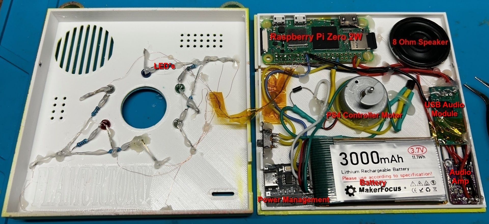

# Pickle Rick Badge Build Guide

This guide documents how I built my DEFCON Pickle Rick Badge, including hardware, wiring, software setup, and practical tips learned along the way.

---

## 1. What I Built

A Raspberry Pi Zero 2 W powered DIY badge with:

- Boot sound (“I’m Pickle Rick!”) played at startup
- SSH login success/fail sounds (“I’m in” / “Disqualified”)
- 6 LEDs in a ring with patterns
- Vibration motor spinner (PS4 rumble motor) via PN2222A + flyback diode
- Five buttons triggering interactive shows

> **Note:** My Pi username is `admin`. If yours is different, update `/home/admin/…` paths in scripts, services, and configs.

---

## 2. Hardware Used

- **Raspberry Pi Zero 2 W**
- **USB audio dongle** + small amplifier/speaker (or headphones for testing)
- **6× LEDs** with 220–330 Ω resistors
- **5× push buttons** (wired to GND + GPIO, using internal pull-ups)
- **PN2222A (or 2N2222) NPN transistor** for motor control
- **Flyback diode** (1N4001 or 1N4148) across motor
- **Li-ion 3.7V cell + 5V boost module** for power
- **Small physical single pole sliding switch** for power control
- **Flux and solder** for reliable connections
- **Enamelled (magnet) wire** for compact wiring
- **Thin-gauge stranded wire** (e.g., 24–28 AWG) for power and signals
- **Electrical tape or Kapton tape** for insulation
- **Hot glue gun** for securing components and strain relief

**GPIO mapping (my wiring):**

- **LEDs (clockwise):** 26, 5, 13, 6, 19, 22
- **Buttons:** 20, 16, 21, 12, 25
- **Motor (PWM):** 18 (via PN2222A, 1k base resistor, 100k base→GND, diode across motor)

---

## 3. 3D Printing the Enclosure

- Print the enclosure parts from the `3d_print_files` folder.
- I used a Creality Ender 3 Pro with PETG filament for durability and heat resistance.
- Clean up and test-fit all parts before assembly.

---

## 4. Assemble the Electronics

1. **LEDs:** Solder in a circular pattern on your PCB or perfboard.
    - Connect a 220Ω or 330Ω resistor between each GPIO pin and the LED anode (longer leg, +).
    - Connect all cathodes (shorter legs, –) together and run to GND.

2. **Motor:** 
    - Solder the motor’s negative terminal to the collector of the PN2222A transistor.
    - Positive terminal goes to the 5V rail (from boost converter).
    - Emitter to GND.
    - 1kΩ resistor between GPIO18 and transistor base; 100kΩ base to GND.
    - Diode (1N4001 or similar) across motor terminals for flyback protection (stripe/cathode to 5V, anode to collector).

3. **Power Circuit:** 
    - Connect LiPo battery (3Ah recommended) to boost converter, then boost converter’s 5V/GND to Pi.
    - Install sliding switch to interrupt the 5V line before it reaches the Pi for safe power control.

4. **Audio:** 
    - Plug USB audio dongle into Pi.
    - Connect dongle output to amplifier module input.
    - Amplifier output to speaker (8Ω, 0.5W–1W recommended).
    - Power amplifier from 5V rail if supported.
    - Secure speaker so sound can exit the enclosure.

---

## 5. Software Setup

1. Flash Raspberry Pi OS to your microSD card.
2. Clone this repo onto the Pi:
   ```bash
   sudo apt update && sudo apt install -y git
cd ~ && git clone <this-repo-url> .
   cd ~/pickle-rick-badge
   ```
3. Install `mpg123` for MP3 playback:
    ```bash
    sudo apt install -y mpg123
    ```
4. Place your MP3s into `./audio_files` (keep filenames: `pickle_rick_loud.mp3`, `im_in.mp3`, `disqualified.mp3`).
5. Run the installer:
   ```bash
   chmod +x setup.sh
   sudo ./setup.sh
   ```
   - This script sets up:
     - `rc.local` to run your main Python script at boot
     - `startup_sound.sh` to play the boot sound
     - `startup-sound.service` to trigger the boot sound via systemd
     - `ssh-fail-sound.service` to play a sound on failed SSH login
     - Updates `.bashrc` to play a sound on successful SSH login and adds a `py` alias for `python3`
6. Reboot to test boot sound & services:
   ```bash
   sudo reboot
   ```

---

## 6. Final Assembly

- Place all components into the 3D printed enclosure.
- Secure with screws or adhesive as needed.
- Double-check all connections before powering on.



*Close-up of the badge electronics before enclosure installation.*

---

## 7. Testing

- Power on the badge using the sliding switch.
- Test each button to ensure the correct show or function triggers.
- Check LEDs, motor, and audio output.

---

## Tips & Lessons Learned

- **Never drive motors directly from GPIO.** Always use a transistor and diode.
- **Common ground:** Ensure Pi GND, motor PSU GND, and button/LED grounds are connected.
- Double-check LED and motor polarity.
- Use heat shrink or tape to insulate exposed wires.
- Customize your badge by adding new sounds or modifying the code.
- If you see a “ghost LED on” at boot, use the provided `led_clear.py` tool.
- For safe power control, always cut the positive (V+) output wire from the boost converter with your sliding switch—not the ground.
- Label wires and take photos during assembly for easier troubleshooting.
- Back up your microSD card in case you need to re-flash or recover your setup.

---

Enjoy building and hacking your custom Pickle Rick Badge!