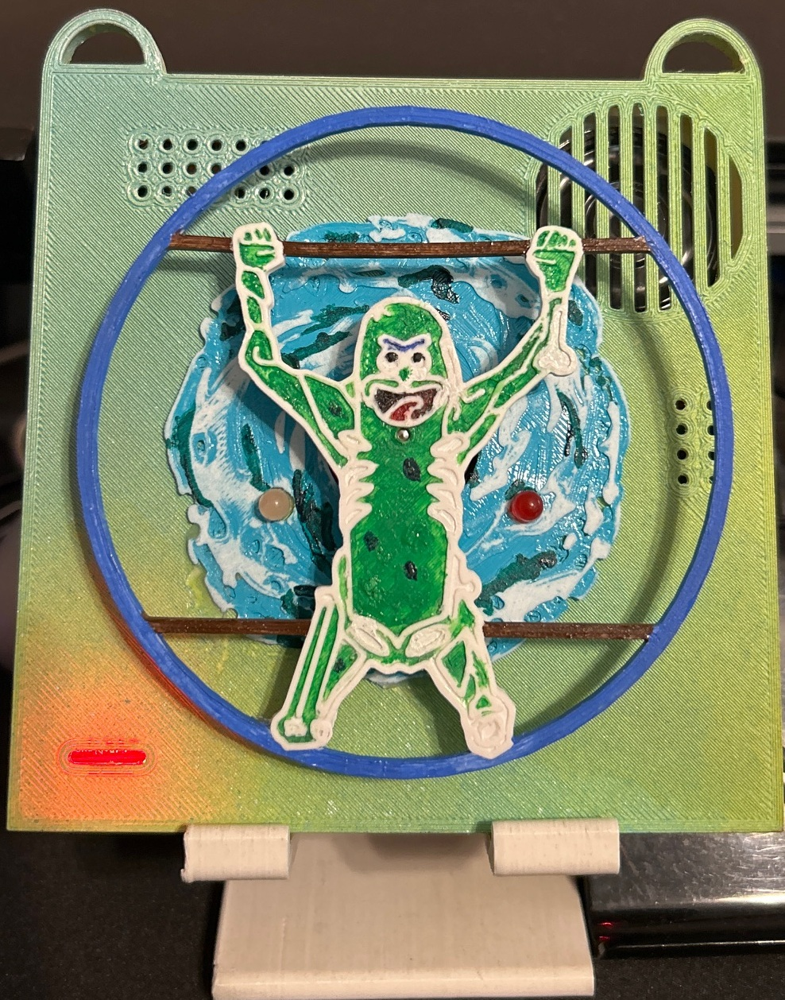

# Pickle Rick Badge Project

## Description
This project is a custom DIY electronic badge inspired by the DEF CON badge community. The badge brings together lights, sound, and motorized elements to create an interactive show triggered by button presses. It’s both a fun hacker-style project and a learning platform for Raspberry Pi GPIO programming, event handling, and hardware hacking.

Beyond the visual and audio shows, this badge will also include **CTF (Capture the Flag) functionality**, allowing others to explore hidden challenges embedded into the badge’s code, hardware, or connected resources. The goal is to create a hands-on, puzzle-filled badge that fits right into the spirit of hacker conferences.

## Project Image

## Materials List
You’ll need the following to build and run the badge:

- **Raspberry Pi Zero 2 W**
- **MicroSD card** flashed with Raspberry Pi OS
- **Push buttons** (x5, GPIO wired)
- **LEDs** (x6, arranged in a circular pattern)
- **Resistors** for LEDs (220Ω or 330Ω recommended for use with Raspberry Pi GPIO)
- **DC hobby motor** (I got one from an old PS4 controller)
- **Diode** (1N4001 or similar, for motor flyback protection)
- **NPN transistor** (PN2222 or similar) for motor control
- **LiPo battery** (3Ah recommended. You can also use the battery from the PS4 controller too, though will not last as long...)
- **Boost converter** (to step up LiPo voltage to 5V for Pi)
- **Small physical single pole sliding switch** (for power control)
- **USB audio interface** (for audio output from the Pi)
- **Small audio amplifier module** (to drive the speaker)
- **Speaker** (8Ω, 0.5W–1W recommended)

For detailed assembly, wiring, and setup instructions, see [BUILD_GUIDE.md](BUILD_GUIDE.md).

## 3D Print Files
3D print files for the badge enclosure are included in this repository. The parts are designed for a Creality Ender 3 Pro and use PETG filament for durability and heat resistance. Feel free to modify or remix the files for your own setup!

## Sounds
A `audio_files` folder is included in this repository, containing the audio files used in the project. These sounds are played during the badge's interactive shows and events. You can replace them with your own audio clips or add new ones to customize your badge experience.

## Features
- **Startup Sound**: Plays "I'm Pickle Rick!" when the Pi boots up.
- **SSH Login Success Sound**: Plays "Son of a B*tch, I'm In!" on successful SSH login.
- **Power Level LEDs**: A set of LEDs displays the current battery level, giving a quick visual indication of remaining power.
- **SSH Login Failure Sound**: Plays "Disqualified!" on unsuccessful SSH login.
- **Power Light Indicator**: An LED illuminates when the badge is powered on, providing a clear visual status.
- **Button 1**: Triggers the *full show* (sound, lights, motor).
- **Button 2**: Triggers the *mini show* (lights + motor only).
- **Other 3 buttons**: Reserved for future expansion, including CTF triggers.
- **CTF Challenges**: Future versions will embed puzzles such as hidden flags in the code, badge interactions, or Easter eggs that encourage reverse engineering, etc.

## Inspired By
The design is inspired by **DEF CON electronic badges** and the broader **badge life community**, where creativity meets hacking culture. These badges often combine art, electronics, and puzzles to create unique experiences. The Pickle Rick Badge follows that tradition by blending fun shows with a CTF challenge element.

## Future CTF Functionality
- Hidden flags inside source code and hardware signals
- Triggered events requiring timing or button sequences
- Audio steganography challenges inside badge sounds
- Network-based puzzles (optional Wi-Fi CTF mode)

---

This project is meant to grow alongside community contributions and ideas. Whether you’re into hardware hacking, Python programming, or CTF puzzle design, this badge offers a platform to experiment and share.

For a step-by-step build walkthrough, see [BUILD_GUIDE.md](BUILD_GUIDE.md).